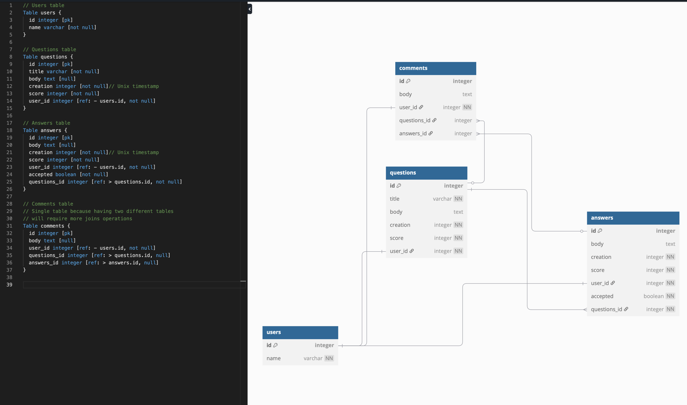

# Sayari Challenge

I first analyse the RAW JSON file in the attached Sayari challenge document to 
see what data fields I am working with. I then create a designed the database
schema putting performance first. 

A special case is the comment table, in which have 2 foreign key: one for questions
and one for answer and only one of which can be filled at once. 
I was thinking about splitting the table comments into two tables, one for 
comments-questions and the other comments-answers but after some analysis I realize that
with the use case I am aiming for I should allow comments to share the same table and
other can be null for quicker query time

include details about API design

include details about docker
+ Set up yaml to call applications or packages for the image to run with my source code
+have separate images for separate images, have separation of concern and do what they need to do only, sperate between api and db

include details about postman testing suite