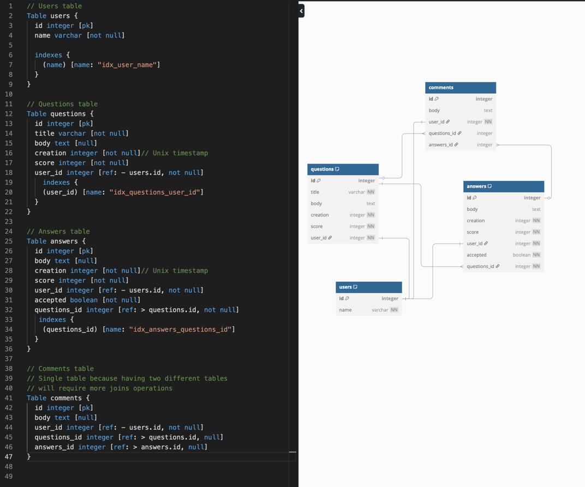
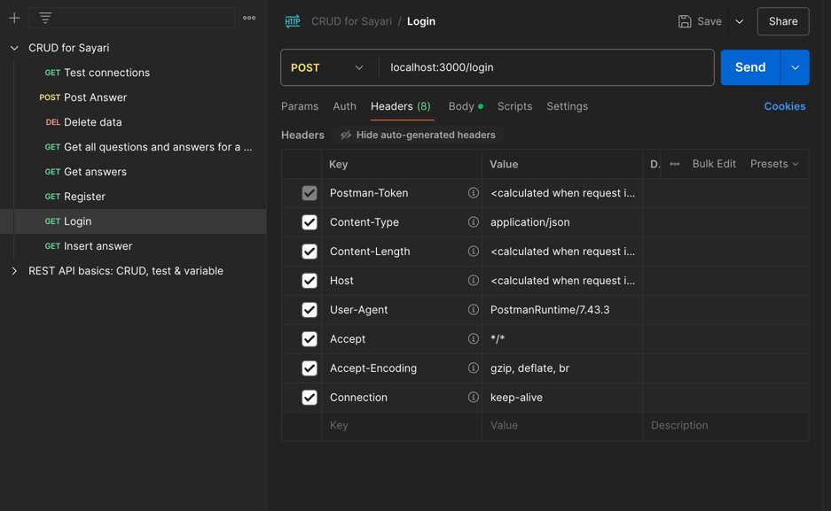

# Sayari Code Challenge
For this challenge, I will focus on three functions:
+ Showing questions and answers for a specific user
+ For a single question show all answers
+ Add a new answer to an existing question

I first analyse the RAW JSON file in the attached Sayari challenge document to 
see what data fields I am working with. I then create a designed the database
schema putting performance first. 

A special case is the comment table, in which have 2 foreign key: one for questions
and one for answer and only one of which can be filled at once. 
I was thinking about splitting the table comments into two tables, one for 
comments-questions and the other comments-answers but after some analysis I realize that
with the use case I am aiming for I should allow comments to share the same table and one 
 of which column can be null for quicker query time

The database design ensures data integrity and no data normalization is required

I limit create indexing to column name in table user, column user_id in table
questions, column questions_id in table answers because my API end-points will
be using these frequently

In order to have a maintainable and easy to read code for large team, I choose 
the Model, View, Controller architecture for this challenge. 
Biggest advantage of this architecture is the separation of concern, allowing 
various developers working on the code base not having to overlap each other. 
It is also much easier to scale because each feature can be in a separate files.

The input of every post request have been restricted by predefined interface to
prevent undefined behavior that can lead to the web application crashing

Dockerfile and docker compose file have een provided to simulate production code
locally and turn the web app into an image, speeding up the process of cloud 
deployment. Web application logic and database are kept in separate containers for 
Separation of Concerns and easier scalability in the future.

To ensure each API end-points works as expected, I have created a testing suite 
in PostMan for each API endpoints.

Besides the three functionality list above, I also have created endpoints for 
authentication and authorization using JWT to limit users access to certain API.
In this case is the insert answer API which only the user who have logged in can 
post answers into the questions.

Future improvements:
+ Incorporate Redis for caching
+ Incorporate Terraform to manage cloud infrastructure after deployed
+ Implemented role-based access to certain API (ex: admin can delete users)

